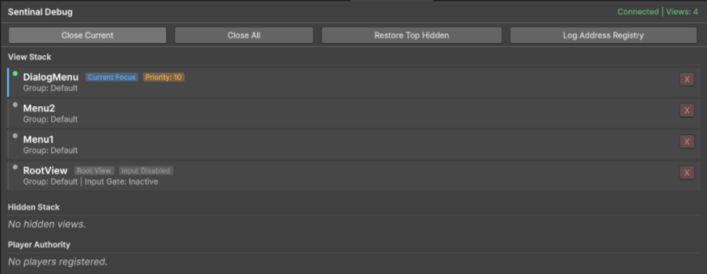
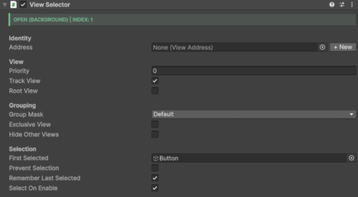
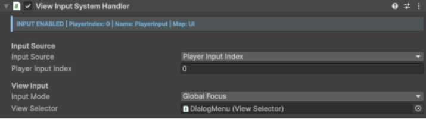
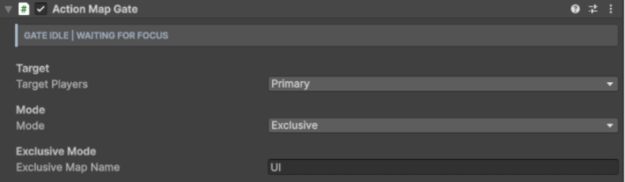

# Sentinal Component Guide

This guide explains the components in Sentinal, what each one owns, and when to use it. Sentinal is split into a small core router and optional Unity Input System helpers.

## Core Concepts

- **View**: A UGUI screen, panel, modal, HUD, or tab page with a `ViewSelector`.
- **Current view**: The focused view chosen by highest priority, then most recent open order.
- **Root view**: A persistent view that should not be closed by normal back/cancel navigation.
- **Address**: A `ViewAddress` ScriptableObject used to open a view without a direct scene reference.
- **Group**: A `ViewGroupMask` channel used to isolate menus, overlays, HUDs, and popups from each other.

## Routing Components

### `SentinalViewRouter`

**Scope:** global static router  
**Add to GameObject:** no

`SentinalViewRouter` owns the active view history, current-view resolution, close/open operations, hidden-view restoration, and router events. Views register themselves when enabled, so you do not need a manager prefab in the scene.



Use it when code needs to open a known address, close the current modal, close a group of views, or inspect the current stack.

```csharp
SentinalViewRouter.OpenView(settingsAddress);
SentinalViewRouter.CloseCurrentView();
SentinalViewRouter.CloseAllViews(excludeRootViews: true);
Debug.Log(SentinalViewRouter.GetDebugString());
```

Key members:

| Member                                          | Purpose                                                         |
| ----------------------------------------------- | --------------------------------------------------------------- |
| `CurrentView`                                   | Focused view based on priority and recency.                     |
| `MostRecentView`                                | Last view added to history.                                     |
| `OpenView(ViewAddress)`                         | Resolves and opens a view through a `ViewAddress`.              |
| `CloseCurrentView()`                            | Closes the focused view unless it is a root view.               |
| `CloseAllViews(...)`                            | Closes all views, optionally filtered by group and root status. |
| `HideAllViews(...)` / `RestoreHiddenViews(...)` | Temporarily hide and restore matching views.                    |
| `OnAdd`, `OnRemove`, `OnSwitch`                 | Events for UI state, debug tools, and input helpers.            |

### `ViewSelector`

**Scope:** one routable UGUI view  
**Add to GameObject:** yes, on the root of a menu/panel/screen

`ViewSelector` makes a GameObject part of Sentinal routing.



Common inspector fields:

| Field                      | Use                                                                                    |
| -------------------------- | -------------------------------------------------------------------------------------- |
| **Address**                | Optional `ViewAddress` for decoupled routing.                                          |
| **Priority**               | Higher priority wins focus over lower priority views. Equal priority uses recency.     |
| **Track View**             | Adds the view to router history while active. Disable for purely local/tab sub-panels. |
| **Root View**              | Prevents cancel/back from auto-closing persistent screens.                             |
| **Group Mask**             | Assigns the view to one or more routing groups.                                        |
| **Exclusive View**         | Closes other matching non-root views when this view opens.                             |
| **Hide Other Views**       | Temporarily hides matching views and restores them when this view closes.              |
| **First Selected**         | Selectable control focused when the view becomes current.                              |
| **Prevent Selection**      | Clears selection for views driven only by input actions.                               |
| **Remember Last Selected** | Restores the last selected child control when focus returns.                           |
| **Select On Enable**       | Selects on the next frame after activation.                                            |

Typical usage:

```csharp
public ViewSelector pauseMenu;

public void TogglePause()
{
    if (pauseMenu.gameObject.activeSelf)
        pauseMenu.Close();
    else
        pauseMenu.Open();
}
```

### `ViewAddress`

**Scope:** ScriptableObject lookup key  
**Create menu:** `Assets > Create > Sentinal > View Address`

`ViewAddress` lets gameplay or UI code open a view without storing a scene hierarchy reference. Assign the same asset to a `ViewSelector`, then call `SentinalViewRouter.OpenView(address)`.

Use addresses for:

- Main menu destinations.
- Settings, credits, profile, and confirmation screens.
- Prefab-backed views that may be spawned or resolved at runtime.

### `ViewLink`

**Scope:** button-level navigation helper  
**Add to GameObject:** UGUI `Button`

`ViewLink` opens a `ViewAddress` from a standard button click. It is the no-code path for menu buttons such as Settings, Back to Lobby, or Open Profile.

### `ViewGroupConfig` and `ViewGroupMask`

**Scope:** shared group configuration and per-view group mask

Groups keep different UI layers independent. For example, a pause menu can close gameplay-menu views without touching the chat overlay or scoreboard.

Use separate groups for surfaces with different lifecycles:

| Group example | Typical views                                  |
| ------------- | ---------------------------------------------- |
| `GameplayHud` | health, score, objective, match timer          |
| `PauseMenu`   | pause root, settings, quit confirmation        |
| `Popup`       | confirmation dialogs, invite prompts, warnings |
| `Lobby`       | player cards, ready screen, mode picker        |

`ViewGroupMask` supports bitwise-style group checks and exposes `Everything` / `Nothing` presets.

## Input System Components

These components compile when Unity's Input System is enabled.

### `SentinalPlayer`

**Scope:** global static player registry  
**Add to GameObject:** no

`SentinalPlayer` maps logical UI roles to `PlayerInput` instances. This is useful for local multiplayer, split-screen, and controller reassignment because UI components can target "primary player" or a numbered key without knowing where the runtime player object lives.

```csharp
SentinalPlayer.SetPrimaryPlayer(playerInput);
SentinalPlayer.SetPlayer(1, secondPlayerInput);

PlayerInput primary = SentinalPlayer.PrimaryPlayer;
PlayerInput playerTwo = SentinalPlayer.GetPlayer(1);
```

### `ViewInputSystemHandler`

**Scope:** per-view input handler  
**Add to GameObject:** alongside `ViewSelector`

`ViewInputSystemHandler` enables or disables view-specific input behavior based on whether its `ViewSelector` is current.



Use it when a view owns input actions only while it has focus.

### `ActionMapGate`

**Scope:** per-view action map gate  
**Add to GameObject:** alongside `ViewSelector`

`ActionMapGate` applies action-map rules when its view becomes focused.



Targets:

| Target           | Behavior                                             |
| ---------------- | ---------------------------------------------------- |
| **Primary**      | Applies to `SentinalPlayer.PrimaryPlayer`.           |
| **All Players**  | Applies to every `PlayerInput` in `PlayerInput.all`. |
| **Specific Key** | Applies to `SentinalPlayer.GetPlayer(playerKey)`.    |

Modes:

| Mode           | Behavior                                                            |
| -------------- | ------------------------------------------------------------------- |
| **Configured** | Applies explicit enable/disable/inherit rules per named action map. |
| **Exclusive**  | Switches the target `PlayerInput` to one named map.                 |

Common examples:

- Pause menu: enable `UI`, disable or stop listening to `Gameplay`.
- Modal prompt: exclusive `UI`.
- Lobby screen: apply to all joined players.

### `ViewDismissalInputHandler`

**Scope:** canvas/global cancel listener  
**Add to GameObject:** persistent UI object or canvas

`ViewDismissalInputHandler` listens for a cancel/back action and closes the focused non-root view.


Use it for:

- `Esc` on keyboard.
- `B` on Xbox-style controllers.
- `Circle` on PlayStation-style controllers.
- Any `UI/Cancel` action in your Input Actions asset.

Group filtering lets different canvases or players close only the views they own.

## Input-Driven UI Components

### `InputActionButton`

**Scope:** one UGUI button  
**Add to GameObject:** `Button`

`InputActionButton` invokes a button's `onClick` from an Input Action. It can trigger on press or release and can optionally send pointer down/up events so visual button states still respond.


Use it for controller shortcuts such as Ready, Start, Confirm, Randomize, or Open Details.

### `InputActionButtonHold`

**Scope:** one UGUI button  
**Add to GameObject:** `Button`

`InputActionButtonHold` invokes a button after the bound action is held for a configured duration. Use the progress events to drive a fill image, radial meter, or hold-to-confirm state.

Use it for destructive or high-commitment actions such as Leave Match, Delete Save, or Ready All.

### `TabbedView`

**Scope:** tab group controller  
**Add to GameObject:** tab container

`TabbedView` connects a list of `Toggle`s to a list of `ViewSelector` panels. When a toggle becomes active, the matching panel is shown and the others are hidden.

Use it for settings categories, inventory pages, character tabs, or lobby panels.

### `TabbedViewInputHandler`

**Scope:** input wrapper for `TabbedView`  
**Add to GameObject:** with or near `TabbedView`

`TabbedViewInputHandler` binds input actions to `TabbedView.Next()` and `TabbedView.Previous()`.

Use it for shoulder-button, bumper, trigger, or keyboard tab cycling.

### `DisplayInputString`

**Scope:** TextMeshPro label  
**Add to GameObject:** `TextMeshProUGUI`

`DisplayInputString` renders the display string for an Input Action binding. It can use the current `PlayerInput` control scheme so the label changes when the active device changes.

Use it for lightweight button prompts such as `[Submit]`, `[Cancel]`, or `[Next Tab]`.

## Text Input Components

### `TextInputGateway`

**Scope:** global text prompt gateway  
**Add to GameObject:** depends on your presenter implementation

`TextInputGateway` is the shared entry point for modal text entry. Register a presenter once, then request prompts from gameplay or UI code without coupling fields to a specific modal prefab.

Use it for player names, room codes, chat snippets, reports, and any controller-friendly text entry flow.

### `PromptedTextField`

**Scope:** button-backed text field  
**Add to GameObject:** UGUI `Button`

`PromptedTextField` turns a normal button into a controller-friendly text field. Clicking the button opens `TextInputGateway`, stores the confirmed value, updates its label, and fires `OnValueChanged`.

Important fields:

| Field                  | Use                                               |
| ---------------------- | ------------------------------------------------- |
| **Value Text**         | TextMeshPro label that displays the stored value. |
| **Header**             | Prompt title.                                     |
| **Placeholder**        | Prompt placeholder text.                          |
| **Multiline**          | Requests a multiline prompt.                      |
| **Max Length**         | Maximum accepted character count.                 |
| **Empty Display Text** | Label shown and stored when the value is empty.   |

## Recommended Setups

### Simple menu screen

- `ViewSelector`
- `ViewLink` on destination buttons
- `ViewDismissalInputHandler` on the canvas

### Pause menu over gameplay

- HUD `ViewSelector` marked as **Root View**
- Pause menu `ViewSelector` in a `PauseMenu` group
- Pause menu `ActionMapGate`
- Global `ViewDismissalInputHandler`

### Couch co-op lobby

- Register each `PlayerInput` through `SentinalPlayer`
- Lobby root `ViewSelector`
- Per-player views using `ActionMapGate` with **Specific Key** when needed
- `InputActionButton` for ready/confirm actions
- `DisplayInputString` for current-device prompts

### Tabbed settings panel

- Parent `TabbedView`
- One `Toggle` per tab
- One `ViewSelector` panel per tab
- `TabbedViewInputHandler` for bumper/trigger navigation

## Troubleshooting

| Symptom                                | Check                                                                                                                            |
| -------------------------------------- | -------------------------------------------------------------------------------------------------------------------------------- |
| Nothing is selected when a view opens  | Assign **First Selected**, ensure an `EventSystem` exists, and check **Prevent Selection**.                                      |
| Back closes the wrong screen           | Check view **Priority**, **Root View**, and `ViewDismissalInputHandler` group filtering.                                         |
| A HUD disappears when opening a menu   | Put HUD and menu in separate groups, or make sure the menu's **Hide Other Views** only targets the intended group.               |
| A view cannot be opened by address     | Confirm the `ViewAddress` asset is assigned to the `ViewSelector`, and that the view is registered or has a resolvable fallback. |
| Gameplay input still fires under menus | Add `ActionMapGate` to the focused menu and verify the target player selection.                                                  |
| Prompts do not open                    | Register a `TextInputGateway` presenter before using `PromptedTextField`.                                                        |

## Image Placeholders

The docs intentionally reference these screenshots so package pages look complete once images are added or replaced:

- `Documentation/Images/Header.png`
- `Documentation/Images/SentinalInspector.png`
- `Documentation/Images/ViewSelector.png`
- `Documentation/Images/ViewInput.png`
- `Documentation/Images/ActionMapManager.png`
- `Documentation/Images/ViewDismissal.png`
