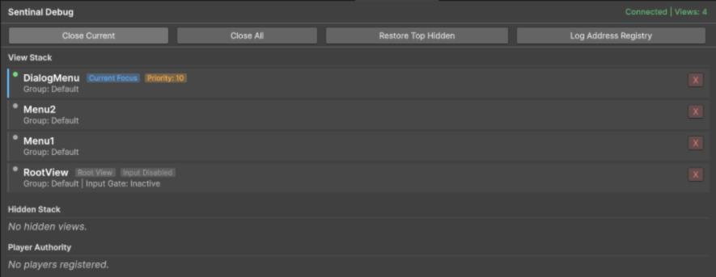
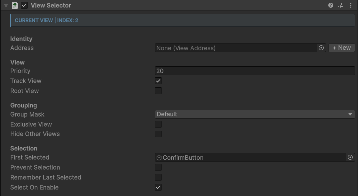
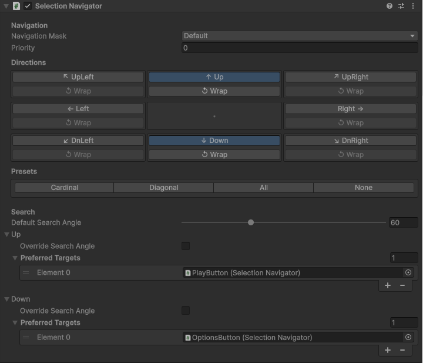
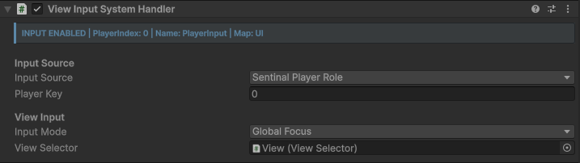
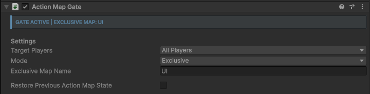
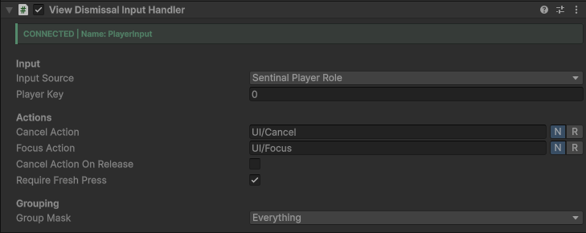
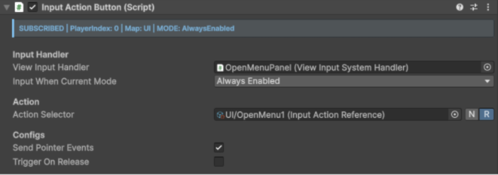

# Sentinal component guide

This guide explains the components in Sentinal, what each one owns, and when to use it. Sentinal is split into a small core router and optional Unity Input System helpers.

## Core concepts

- **View**: A UGUI screen, panel, modal, HUD, or tab page with a `ViewSelector`.
- **Current view**: The focused view chosen by highest priority, then most recent open order.
- **Root view**: A persistent view that should not be closed by normal back/cancel navigation.
- **Address**: A `ViewAddress` ScriptableObject used to open a view without a direct scene reference.
- **Group**: A `ViewGroupMask` channel used to isolate menus, overlays, HUDs, and popups from each other.

## Routing components

### `SentinalViewRouter`

**Scope:** global static router  
**Add to GameObject:** no

`SentinalViewRouter` owns the active view history, current-view resolution, close/open operations, hidden-view restoration, and router events. Views register themselves when enabled, so you do not need a manager prefab in the scene.



Use it when code needs to open a known address, close the current modal, close a group of views, or inspect the current stack.

```csharp
SentinalViewRouter.OpenView(settingsAddress);
SentinalViewRouter.CloseCurrentView();
SentinalViewRouter.CloseAllViews(excludeRootViews: true);
Debug.Log(SentinalViewRouter.GetDebugString());
```

Key members:

| Member                                          | Purpose                                                         |
| ----------------------------------------------- | --------------------------------------------------------------- |
| `CurrentView`                                   | Focused view based on priority and recency.                     |
| `MostRecentView`                                | Last view added to history.                                     |
| `OpenView(ViewAddress)`                         | Resolves and opens a view through a `ViewAddress`.              |
| `CloseCurrentView()`                            | Closes the focused view unless it is a root view.               |
| `CloseAllViews(...)`                            | Closes all views, optionally filtered by group and root status. |
| `HideAllViews(...)` / `RestoreHiddenViews(...)` | Temporarily hide and restore matching views.                    |
| `OnAdd`, `OnRemove`, `OnSwitch`                 | Events for UI state, debug tools, and input helpers.            |

### `ViewSelector`

**Scope:** one routable UGUI view  
**Add to GameObject:** yes, on the root of a menu/panel/screen

`ViewSelector` makes a GameObject part of Sentinal routing.



Common inspector fields:

| Field                      | Use                                                                                    |
| -------------------------- | -------------------------------------------------------------------------------------- |
| **Address**                | Optional `ViewAddress` for decoupled routing.                                          |
| **Priority**               | Higher priority wins focus over lower priority views. Equal priority uses recency.     |
| **Track View**             | Adds the view to router history while active. Disable for purely local/tab sub-panels. |
| **Root View**              | Prevents cancel/back from auto-closing persistent screens.                             |
| **Group Mask**             | Assigns the view to one or more routing groups.                                        |
| **Exclusive View**         | Closes other matching non-root views when this view opens.                             |
| **Hide Other Views**       | Temporarily hides matching views and restores them when this view closes.              |
| **First Selected**         | Selectable control focused when the view becomes current.                              |
| **Prevent Selection**      | Clears selection for views driven only by input actions.                               |
| **Remember Last Selected** | Restores the last selected child control when focus returns.                           |
| **Select On Enable**       | Selects on the next frame after activation.                                            |

Typical usage:

```csharp
public ViewSelector pauseMenu;

public void TogglePause()
{
    if (pauseMenu.gameObject.activeSelf)
        pauseMenu.Close();
    else
        pauseMenu.Open();
}
```

### `ViewAddress`

**Scope:** ScriptableObject lookup key  
**Create menu:** `Assets > Create > Sentinal > View Address`

`ViewAddress` lets gameplay or UI code open a view without storing a scene hierarchy reference. Assign the same asset to a `ViewSelector`, then call `SentinalViewRouter.OpenView(address)`.

Use addresses for:

- Main menu destinations.
- Settings, credits, profile, and confirmation screens.
- Prefab-backed views that may be spawned or resolved at runtime.

### `ViewLink`

**Scope:** button-level navigation helper  
**Add to GameObject:** UGUI `Button`

`ViewLink` opens a `ViewAddress` from a standard button click. It is the no-code path for menu buttons such as Settings, Back to Lobby, or Open Profile.

### `ViewGroupConfig` and `ViewGroupMask`

**Scope:** shared group configuration and per-view group mask

Groups keep different UI layers independent. For example, a pause menu can close gameplay-menu views without touching the chat overlay or scoreboard.

Use separate groups for surfaces with different lifecycles:

| Group example | Typical views                                  |
| ------------- | ---------------------------------------------- |
| `GameplayHud` | health, score, objective, match timer          |
| `PauseMenu`   | pause root, settings, quit confirmation        |
| `Popup`       | confirmation dialogs, invite prompts, warnings |
| `Lobby`       | player cards, ready screen, mode picker        |

`ViewGroupMask` supports bitwise-style group checks and exposes `Everything` / `Nothing` presets.

### `SelectionNavigator`

**Add to GameObject:** alongside any UGUI `Selectable`

`SelectionNavigator` handles mask-aware spatial selection instead of UGUI Automatic navigation. It registers while enabled, so controls created or enabled at runtime take part immediately.



The component disables the attached `Selectable`'s built-in navigation. Leave UGUI navigation alone after that. Cardinal directions are enabled by default and diagonals stay off until you turn them on.

Each move resolves in a fixed order:

1. The first valid preferred target, in authored order.
2. Automatic spatial search.
3. Wrap, if enabled for that direction. Otherwise selection stays put.

Use **Navigation Mask** to keep unrelated controls apart. Masks share the project `ViewGroupConfig` with views, but a navigator's mask is independent from a `ViewSelector` on the same object. `Nothing` matches no candidates. `Everything` matches every group.

Automatic search measures from the source `RectTransform`'s facing edge to each candidate's center, using the direction's search angle, distance, and target priority. Each enabled direction can override the default search angle for layouts that need a wider or narrower cone; an angle of 0 disables automatic search so only preferred targets apply. Diagonal input requires the configurable threshold; when that diagonal is disabled, input falls back to an enabled cardinal axis.

#### The Directions grid

One cell per direction: the toggle allows it, the `↺ Wrap` strip jumps to the opposite end of the sibling list when nothing else is found. The strip stays disabled until its direction is allowed.

Wrap needs a list, not a grid. It looks at siblings under the same parent and only applies along the list's long axis, so a vertical button stack wraps up and down, a horizontal row wraps left and right, and a 2D grid does not wrap. Wrap is off by default. Preferred targets and automatic hits always win over it, and masks and interactability still filter candidates.

Worked example for a pause menu: enable wrap Up and Down on the buttons stacked under `Buttons`, and wrap Left and Right on the bottom Menu/Lobby/Exit row. Down past the last button jumps to the first, Left past Menu jumps to Exit, and nothing else changes.

#### Reading the Scene gizmos

Select a button. Solid lines are authored preferred targets. Dotted lines in the direction color are automatic targets. Dotted cyan lines tagged `(wrap)` are wrap targets, drawn only when wrap would actually fire. The fan is the search cone. All of this works in edit mode, including open prefab stages.

If a line points somewhere stupid, the layout is usually the problem: overlapping rects, a rotated container widening screen bounds, or a cone too wide for a dense row. Narrow the search angle or fix the spacing before hand-wiring preferred targets around it.

## Input System components

These components compile when Unity's Input System is enabled.

### `SentinalPlayer`

**Scope:** global static player registry  
**Add to GameObject:** no

`SentinalPlayer` maps logical UI roles to `PlayerInput` instances. This is useful for local multiplayer, split-screen, and controller reassignment because UI components can target "primary player" or a numbered key without knowing where the runtime player object lives.

```csharp
SentinalPlayer.SetPrimaryPlayer(playerInput);
SentinalPlayer.SetPlayer(1, secondPlayerInput);

PlayerInput primary = SentinalPlayer.PrimaryPlayer;
PlayerInput playerTwo = SentinalPlayer.GetPlayer(1);
```

### `ViewInputSystemHandler`

**Scope:** per-view input handler  
**Add to GameObject:** alongside `ViewSelector`

`ViewInputSystemHandler` enables or disables view-specific input behavior based on whether its `ViewSelector` is current.



Use it when a view owns input actions only while it has focus.

### `ActionMapGate`

**Scope:** per-view action map gate  
**Add to GameObject:** alongside `ViewSelector`

`ActionMapGate` applies action-map rules when its view becomes focused.



Targets:

| Target           | Behavior                                             |
| ---------------- | ---------------------------------------------------- |
| **Primary**      | Applies to `SentinalPlayer.PrimaryPlayer`.           |
| **All Players**  | Applies to every `PlayerInput` in `PlayerInput.all`. |
| **Specific Key** | Applies to `SentinalPlayer.GetPlayer(playerKey)`.    |

Modes:

| Mode           | Behavior                                                            |
| -------------- | ------------------------------------------------------------------- |
| **Configured** | Applies explicit enable/disable/inherit rules per named action map. |
| **Exclusive**  | Switches the target `PlayerInput` to one named map.                 |

Common examples:

- Pause menu: enable `UI`, disable or stop listening to `Gameplay`.
- Modal prompt: exclusive `UI`.
- Lobby screen: apply to all joined players.

**Restore Previous Action Map State** is off by default and usually stays off. Each view applies its own rules on focus, and project code owns the trip back (enable `Gameplay` when no gated view is current). Turn restore on for a view that must put the maps back exactly as it found them when it closes.

A gate with restore enabled captures each target player's map state the first time it applies. Late-joining players get captured on first sighting. A background gate dropping out clears its snapshot without touching the live maps.

Restore timing (shown while restore is enabled):

| Timing          | Behavior                                                                                                                                                          |
| --------------- | ----------------------------------------------------------------------------------------------------------------------------------------------------------------- |
| **OnDisable**   | Holds the snapshot across refocusing and restores only when the owning gate is disabled while its view is current. Nested restore gates unwind like a stack, innermost first. Use for modals over menus. |
| **OnFocusLost** | Restores as soon as the view loses focus, so the next view captures a clean base instead of this gate's applied state. Use for sibling views that each clean up after themselves. |

Pick one strategy per player scope. Mixing `OnDisable` and `OnFocusLost` gates over the same players can clobber snapshots: the losing gate must restore before the gaining gate captures, which follows enable order, so enable background views before the modals that cover them.

### `ViewDismissalInputHandler`

**Scope:** canvas/global cancel listener  
**Add to GameObject:** persistent UI object or canvas

`ViewDismissalInputHandler` listens for a cancel/back action and closes the focused non-root view.



Use it for:

- `Esc` on keyboard.
- `B` on Xbox-style controllers.
- `Circle` on PlayStation-style controllers.
- Any `UI/Cancel` action in your Input Actions asset.

Group filtering lets different canvases or players close only the views they own.

## Input-driven UI components

### `InputActionButton`

**Scope:** one UGUI button  
**Add to GameObject:** `Button`

`InputActionButton` invokes a button's `onClick` from an Input Action. It can trigger on press or release and can optionally send pointer down/up events so visual button states still respond.



Use it for controller shortcuts such as Ready, Start, Confirm, Randomize, or Open Details.

### `InputActionButtonHold`

**Scope:** one UGUI button  
**Add to GameObject:** `Button`

`InputActionButtonHold` invokes a button after the bound action is held for a configured duration. Use the progress events to drive a fill image, radial meter, or hold-to-confirm state.

Use it for destructive or high-commitment actions such as Leave Match, Delete Save, or Ready All.

### `TabbedView`

**Scope:** tab group controller  
**Add to GameObject:** tab container

`TabbedView` connects a list of `Toggle`s to a list of `ViewSelector` panels. When a toggle becomes active, the matching panel is shown and the others are hidden.

Use it for settings categories, inventory pages, character tabs, or lobby panels.

### `TabbedViewInputHandler`

**Scope:** input wrapper for `TabbedView`  
**Add to GameObject:** with or near `TabbedView`

`TabbedViewInputHandler` binds input actions to `TabbedView.Next()` and `TabbedView.Previous()`.

Use it for shoulder-button, bumper, trigger, or keyboard tab cycling.

### `DisplayInputString`

**Scope:** TextMeshPro label  
**Add to GameObject:** `TextMeshProUGUI`

`DisplayInputString` renders the display string for an Input Action binding. It can use the current `PlayerInput` control scheme so the label changes when the active device changes.

Use it for button prompts such as `[Submit]`, `[Cancel]`, or `[Next Tab]`.

## Text input components

### `TextInputGateway`

**Scope:** global text prompt gateway  
**Add to GameObject:** depends on your presenter implementation

`TextInputGateway` is the shared entry point for modal text entry. Register a presenter once, then request prompts from gameplay or UI code without coupling fields to a specific modal prefab.

Use it for player names, room codes, chat snippets, reports, and any controller-friendly text entry flow.

### `PromptedTextField`

**Scope:** button-backed text field  
**Add to GameObject:** UGUI `Button`

`PromptedTextField` turns a normal button into a controller-friendly text field. Clicking the button opens `TextInputGateway`, stores the confirmed value, updates its label, and fires `OnValueChanged`.

Important fields:

| Field                  | Use                                               |
| ---------------------- | ------------------------------------------------- |
| **Value Text**         | TextMeshPro label that displays the stored value. |
| **Header**             | Prompt title.                                     |
| **Placeholder**        | Prompt placeholder text.                          |
| **Multiline**          | Requests a multiline prompt.                      |
| **Max Length**         | Maximum accepted character count.                 |
| **Empty Display Text** | Label shown and stored when the value is empty.   |

## Recommended setups

### Simple menu screen

```
Menu                              ViewSelector
├── Title                         TextMeshProUGUI
└── Buttons
    ├── PlayButton                Button, SelectionNavigator, ViewLink
    ├── SettingsButton            Button, SelectionNavigator, ViewLink
    └── ExitButton                Button, SelectionNavigator, ViewLink
```

`ViewSelector`, `ViewLink` on destination buttons, `ViewDismissalInputHandler` on the canvas.

### Pause menu over gameplay

```
GameplayHud                       ViewSelector (Root View)
PauseMenu                         ViewSelector, ViewInputSystemHandler, ActionMapGate
├── Header                        TextMeshProUGUI
└── Buttons
    ├── ResumeButton              Button, SelectionNavigator
    ├── OptionsButton             Button, SelectionNavigator
    └── QuitButton                Button, SelectionNavigator
```

HUD `ViewSelector` marked as **Root View**, pause menu `ViewSelector` in a `PauseMenu` group, pause menu `ActionMapGate`, global `ViewDismissalInputHandler`. Enable wrap Up/Down on the `Buttons` stack so Down past Quit jumps back to Resume.

### Couch co-op lobby

```
Lobby                             ViewSelector (Root View)
├── PlayerCards
│   ├── CardP1                    ViewSelector, ActionMapGate (Specific Key 0)
│   └── CardP2                    ViewSelector, ActionMapGate (Specific Key 1)
└── Footer
    ├── ReadyButton               Button, SelectionNavigator, InputActionButton
    └── StartButton               Button, SelectionNavigator, InputActionButton
```

Register each `PlayerInput` through `SentinalPlayer`, lobby root `ViewSelector`, per-player views using `ActionMapGate` with **Specific Key** when needed, `InputActionButton` for ready/confirm actions, `DisplayInputString` for current-device prompts.

### Tabbed settings panel

```
Settings                          ViewSelector
├── TabBar                        TabbedView, TabbedViewInputHandler
│   ├── AudioTab                  Toggle
│   └── VideoTab                  Toggle
├── AudioPanel                    ViewSelector (Track View off)
└── VideoPanel                    ViewSelector (Track View off)
```

Parent `TabbedView`, one `Toggle` per tab, one `ViewSelector` panel per tab, `TabbedViewInputHandler` for bumper/trigger navigation.

## Coming from BNav

| BNav                              | Sentinal                                                     | What changed                                                  |
| --------------------------------- | ------------------------------------------------------------ | ------------------------------------------------------------- |
| `belongGroup` string              | Navigation Mask + `ViewGroupConfig`                          | Bitmask instead of strings, no Resources lookup in the hot path |
| `searchRangeUp` etc. (0 to 1)     | Search angle in degrees per direction (default 60)           | 0 disables automatic search                                   |
| `fallbackNavigations` lists       | Preferred targets plus wrap directions                       | Order flipped: preferred targets win *before* automatic search |
| `ignoreTop` etc. (AutoSync)       | Facing-edge-to-center measurement                            | No manual margins to tune                                     |
| `enableUp` booleans               | Allowed Directions grid                                      | Adds individually enabled diagonals                           |
| `priority`                        | Priority                                                     | Tie-break only, with a near-tie tolerance                     |
| `debugFollowNavigation`           | Scene gizmos plus the Debug window                           | Works in edit mode, including prefab stages                   |
| `Selectable.Select()`             | Selection through the event's EventSystem                    | Safe with several EventSystems (split-screen, couch co-op)    |

## Troubleshooting

| Symptom                                | Check                                                                                                                            |
| -------------------------------------- | -------------------------------------------------------------------------------------------------------------------------------- |
| Nothing is selected when a view opens  | Assign **First Selected**, ensure an `EventSystem` exists, and check **Prevent Selection**.                                      |
| Back closes the wrong screen           | Check view **Priority**, **Root View**, and `ViewDismissalInputHandler` group filtering.                                         |
| A HUD disappears when opening a menu   | Put HUD and menu in separate groups, or make sure the menu's **Hide Other Views** only targets the intended group.               |
| A view cannot be opened by address     | Confirm the `ViewAddress` asset is assigned to the `ViewSelector`, and that the view is registered or has a resolvable fallback. |
| Gameplay input still fires under menus | Add `ActionMapGate` to the focused menu and verify the target player selection.                                                  |
| Prompts do not open                    | Register a `TextInputGateway` presenter before using `PromptedTextField`.                                                        |
| Navigation jumps to an unexpected target | Select the source button and read the dotted gizmo link. Overlapping rects (check rotated containers), a too-wide search angle, or a shared mask with a distant control are the usual causes. |
| Wrap never fires                       | Wrap needs sibling buttons under one parent, a list rather than a grid along that axis, and the wrap flag on for the direction. Grids and lone buttons never wrap. |
| Maps stay wrong after a menu closes    | Only the focused view's gate applies rules. Give the closing menu's replacement its own gate, or let project code re-enable gameplay maps when no gated view is current. |
