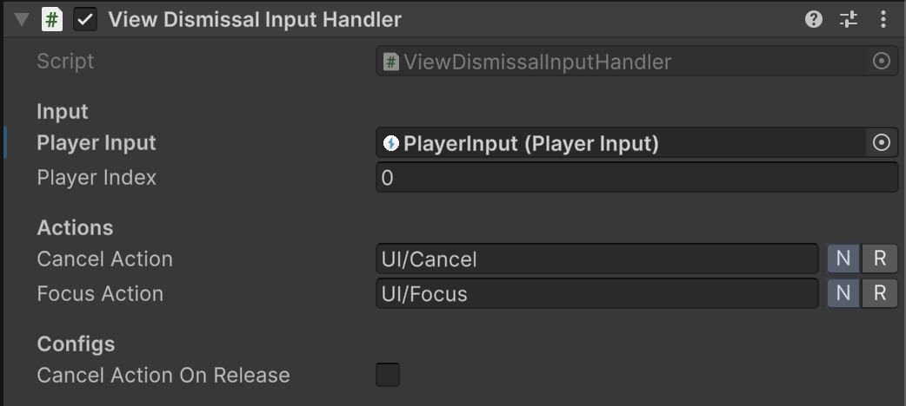
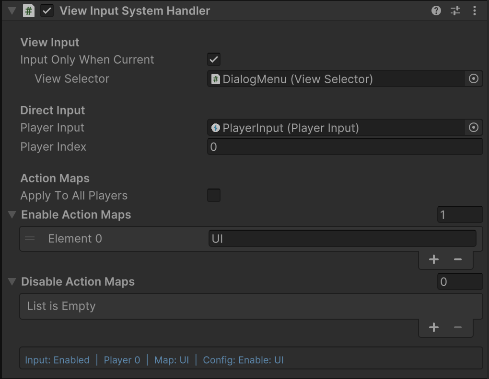

# Sentinal - Unity Menu Navigation & UI Selection System

A Unity package for managing hierarchical menu navigation with history tracking, input system integration, and automatic UI element selection. Perfect for game menus, settings panels, and any UI that requires structured navigation flow.

> [!NOTE]  
> This does not replace **UGUI's navigation system.**

## QUICK START

### Install via git...

**Package Manager > Add/Plus Symbol > Install package via git...**

```console
https://github.com/Tirtstan/Sentinal.git
```

### Set Up

> [!TIP]  
> Use the provided **Sentinal** prefab from the samples for quick setup.

1. **Add the Core Manager**: Place the `SentinalManager` singleton component in your scene.
2. **(Input System) Add helpers**: On the same GameObject as `SentinalManager`, add:
    - `ViewDismissalInputHandler` (Cancel/Back + refocus)
    - `ActionMapManager` (optional, for action map overlays)
3. **Setup Menu Views**: Add `ViewSelector` components to your active toggling menu GameObjects.
4. **(Input System) Per-view input**: Add `ViewInputSystemHandler` alongside `ViewSelector` on views that need input gating and/or action map changes.

> [!NOTE]  
> Input System features require the Unity Input System package in your project.

> [!IMPORTANT]  
> **The `SentinalManager` component is required for this package to work. View tracking is triggered by GameObject activation/deactivation (`OnEnable`/`OnDisable`).**

## FEATURES

### Core Navigation

-   **Menu/View Tracking**: Navigate through multiple menus with automatic history tracking.
-   **Priority-Based Focus**: Views are focused based on priority (higher priority first), with recency as tie-breaker.
-   **UI Selection**: Auto-selection of UI elements with memory of last selected items.
-   **Dismissal-Protected Views**: Views can be tracked but not auto-closed (`preventDismissal`).
-   **Exclusive Views**: Views that close all other views (except dismissal-protected views) when opened.

### Input System Integration

-   **Action Map Overlays**: Intelligent action map management that tracks enabled/disabled maps per view.
-   **Per-View Input Gating**: Enable/disable input for specific views based on focus.
-   **Single or Multi-Player**: Support for single PlayerInput or apply to all players simultaneously.
-   **Efficient Switching**: Recomputes action maps when switching between menus, not just on close.
-   **Configurable Actions**: Customisable input actions for canceling and re-selecting.

## CORE COMPONENTS

### `SentinalManager` (Singleton Manager)

The central manager that handles all view/menu navigation logic and maintains the view stack.


**Public API:**

-   `CloseCurrentView()` - Close the focused view in the stack.
-   `CloseAllViews()` - Close all views (optionally excluding dismissal-protected views).
-   `TrySelectCurrentView()` - Attempt to select the focused view's UI element.
-   `AnyViewsOpen` - Check if any views are currently open.
-   `CurrentView` - Get the currently focused view selector (priority + recency).
-   `MostRecentView` - Get the most recently opened view selector.

**Events:**

-   `OnAdd` - Fired when a new view is added to the stack.
-   `OnRemove` - Fired when a view is removed from the stack.
-   `OnSwitch` - Fired when switching between views.

### `ViewSelector` (Menu Component)

Add this to any GameObject that represents a menu or navigable view. One that will be `SetActive(bool)`.


#### **Properties:**

##### **View**

-   `priority` - Focus priority (higher values get focus first; equal priority uses recency).
-   `firstSelected` - The GameObject to auto-select when this view becomes active.
-   `preventDismissal` - Track this view, but prevent it from being dismissed by `ViewDismissalInputHandler` or `CloseCurrentView()`.
-   `exclusiveView` - Close all other views (except dismissal-protected views) when this view opens.
-   `hideOtherViews` - Temporarily hide other views while this view is open.
-   `trackView` - Whether to include this view in the navigation history stack.

##### **Selection**

-   `preventSelection` - Prevent automatic selection (useful for input-only views).
-   `autoSelectOnEnable` - Automatically select the first element when the view is enabled.
-   `rememberLastSelected` - Remember and restore the last selected UI element.

##### **Input**

-   (Input System) Add `ViewInputSystemHandler` on the same GameObject to gate input and/or apply action maps.

### `ViewDismissalInputHandler` (Input System: Dismiss + Refocus)




Listens for two Input System actions:

- Cancel/Back → `SentinalManager.Instance.CloseCurrentView()`
- Focus → `SentinalManager.Instance.TrySelectCurrentView()`

Recommended placement: **same GameObject as `SentinalManager`**.

### `ViewInputSystemHandler` (Input System: Per-View Input + Action Maps)




Per-view handler that can:

- Enable/disable “input enabled” state depending on whether the view is the current view (`InputOnlyWhenCurrent`).
- (Optionally) Apply action map changes when enabled or disabled.

Key fields:

- `inputOnlyWhenCurrent` (default true)
- `viewSelector` (optional, but required if `inputOnlyWhenCurrent` is true)
- `playerInput` / `playerIndex`
- `applyToAllPlayers`
- `enableActionMaps` / `disableActionMaps`

### `ActionMapManager` (Input System: Global Action Map Coordinator)

Singleton that tracks and manages action map overlays across views using `ViewInputSystemHandler` configuration. Recomputes on view focus changes and restores previous state correctly.

## USAGE EXAMPLES

### Basic Menu Setup

```csharp
// Your menu GameObject needs:
// 1. ViewSelector component
// 2. Enable/Disable the GameObject to open/close menus

// Open a menu
menuGameObject.SetActive(true); // Automatically tracked by SentinalManager (if ViewSelector is present)
// OR
viewSelector.Open();

// Close current menu
SentinalManager.Instance.CloseCurrentView();

// Close all menus
SentinalManager.Instance.CloseAllViews();
```

### Custom Closeable Menu With `ICloseableView`

```csharp
[RequireComponent(typeof(ViewSelector))]
public class CustomMenu : MonoBehaviour, ICloseableView
{
    [SerializeField] private Animator menuAnimator;

    public void Close()
    {
        // Custom close logic (animations, save data, etc.)
        StartCoroutine(CloseWithAnimation());
    }

    private IEnumerator CloseWithAnimation()
    {
        menuAnimator.SetTrigger("CloseMenu");
        yield return new WaitForSeconds(0.3f);
        gameObject.SetActive(false);
    }
}
```

### Event Handling & Stack Monitoring

```csharp
private void Start()
{
    SentinalManager.OnAdd += OnMenuOpened;
    SentinalManager.OnRemove += OnMenuClosed;
    SentinalManager.OnSwitch += OnMenuSwitched;
}

private void OnMenuOpened(ViewSelector view)
{
    Debug.Log($"Menu opened: {view.name}");
    // Update UI, play sounds, etc.
}

private void OnMenuSwitched(ViewSelector from, ViewSelector to)
{
    Debug.Log($"Switched from {from?.name} to {to?.name}");
    // Handle transition effects
}
```

## REQUIREMENTS

-   **Unity 2021.3** or later
-   **Input System package** (optional, for input handling features)
-   **TextMeshPro** (for sample scenes)

## DEBUGGING

### Runtime Inspector

The custom editor shows real-time debugging information:

-   **SentinalManager**: Shows focused view vs most recent view, view list with priority and input state.
-   **ViewSelector**: Shows priority, history index, focus state, input enabled, connected PlayerInput.
-   **ViewInputSystemHandler**: Shows input enabled state and action map configuration (Input System).

## BEST PRACTICES

1. **Always use GameObject activation (`SetActive(bool)`)** for menu open/close operations.
2. **Use `ICloseableView`** for menus that need custom close animations or specific menu closure.
3. **Use `preventDismissal`** for persistent UI elements like HUDs or a main menu screen.
4. **Use Exclusive Views** for modal dialogs or full-screen overlays.
5. **Set Priority** on views that should always be focused when open (e.g., error dialogs).
6. **Use `ViewInputSystemHandler.InputOnlyWhenCurrent`** to prevent input conflicts between multiple open views.
7. **Configure Action Maps** per view via `ViewInputSystemHandler` to enable both UI and gameplay maps simultaneously when needed (e.g., touch controls).

