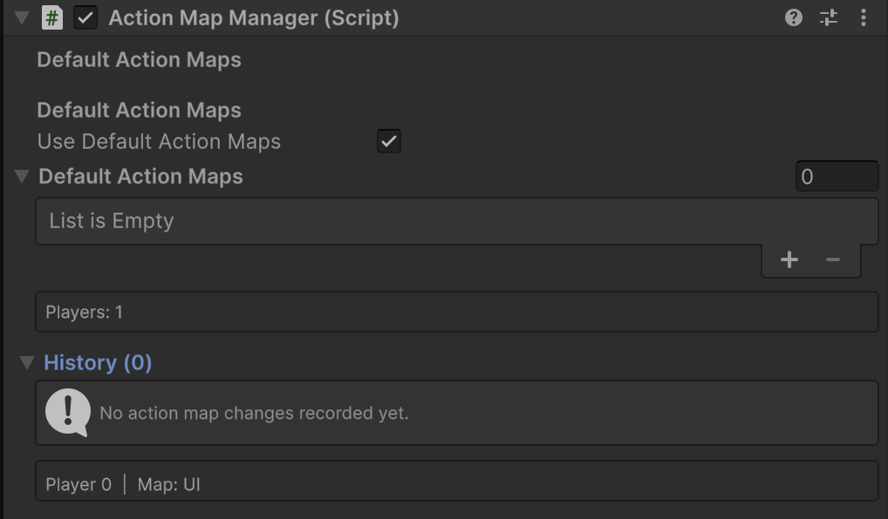

# Sentinal - Unity Menu Navigation & UI Selection System

A Unity package for managing menu navigation with history tracking, input system integration, and automatic UI element selection. Perfect for game menus, settings panels, and any UI that requires structured navigation flow.

> [!NOTE]  
> This does not replace **UGUI's navigation system.**

## QUICK START

### Install via git...

**Package Manager > Add/Plus Symbol > Install package via git...**

```console
https://github.com/Tirtstan/Sentinal.git
```

### Set Up

> [!TIP]  
> Use the provided **Sentinal** prefab from the samples for quick setup.

1. **Add the Core Manager**: Place the `SentinalManager` singleton component in your scene.
2. **(Input System) Add helpers**: On the same GameObject as `SentinalManager`, add:
    - `ViewDismissalInputHandler` (Cancel/Back + refocus)
    - `ActionMapManager` (optional, for action map overlays)
3. **Setup Menu Views**: Add `ViewSelector` components to your active toggling menu GameObjects.
4. **(Input System) Per-view input**: Add `ViewInputSystemHandler` alongside `ViewSelector` on views that need input gating and/or action map changes.

> [!NOTE]  
> Input System features require the Unity Input System package in your project.

> [!IMPORTANT]  
> **The `SentinalManager` component is required for this package to work. View tracking is triggered by GameObject activation/deactivation (`OnEnable`/`OnDisable`).**

## FEATURES

### Core Navigation

- **Tracked Views & Focus**: Automatic view stack with history, priority-based focus (higher priority + recency), and optional root views that stay open.
- **Selection & Exclusive Behaviour**: Auto-selection with last-selected memory, plus exclusive views that close/hide other views (excluding root views).
- **View Groups**: Optional grouping via `SentinalViewGroups` and `groupMask` so exclusive/hide behaviour only affects views in the same group(s).

### Input System Integration

- **Per-View Input & Gating**: Gate input per view based on focus and configure action maps for when views are enabled/disabled (via `ActionMapConfig`).
- **Action Map Overlays & Defaults**: Global `ActionMapManager` tracks per-view overlays, recomputes on switches, and applies default action maps when no non-root views are open.
- **Single or Multi-Player**: Works with a single `PlayerInput` or across all players at once.
- **Event System Support**: Supports both C# Events (`InvokeCSharpEvents`) and Unity Events (`InvokeUnityEvents`) notification behaviors on `PlayerInput`.

## CORE COMPONENTS

### `SentinalManager` (Singleton Manager)

The central manager that handles all view/menu navigation logic and maintains the view stack.


**Public API:**

- `CloseCurrentView()` - Close the focused view in the stack.
- `CloseAllViews()` - Close all views (optionally excluding root views).
- `CloseAllViews(int groupMask, bool excludeRootViews = false)` - Close all views in the given group(s) (optionally excluding root views).
- `TrySelectCurrentView()` - Attempt to select the focused view's UI element.
- `AnyViewsOpen` - Check if any views are currently open.
- `CurrentView` - Get the currently focused view selector (priority + recency).
- `MostRecentView` - Get the most recently opened view selector.

**Events:**

- `OnAdd` - Fired when a new view is added to the stack.
- `OnRemove` - Fired when a view is removed from the stack.
- `OnSwitch` - Fired when switching between views.

### `ViewSelector` (Menu Component)

Add this to any GameObject that represents a menu or navigable view. One that will be `SetActive(bool)`.


#### **Properties:**

##### **View**

- `priority` - Focus priority (higher values get focus first; equal priority uses recency).
- `firstSelected` - The GameObject to auto-select when this view becomes active.
- `rootView` - Root view: does not get auto-closed, has special permissions around being closed; can still be hidden (e.g. main menu, HUD).
- `groupMask` - Optional bitmask of view groups for this view. Groups are defined in the shared `SentinalViewGroups` asset (`Assets/Resources/SentinalViewGroups.asset`) and control how exclusive/hide behaviour is scoped.
- `exclusiveView` - Close other views (except root views) when this view opens; when a non-zero `groupMask` is set, only affects views in the same group(s).
- `hideOtherViews` - Temporarily hide other views while this view is open; when a non-zero `groupMask` is set, only affects views in the same group(s).
- `trackView` - Whether to include this view in the navigation history stack.

##### **Selection**

- `preventSelection` - Prevent automatic selection (useful for input-only views).
- `autoSelectOnEnable` - Automatically select the first element when the view is enabled.
- `rememberLastSelected` - Remember and restore the last selected UI element.

##### **Input**

- (Input System) Add `ViewInputSystemHandler` on the same GameObject to gate input and/or apply action maps.

### `ViewDismissalInputHandler` (Input System: Dismiss + Refocus)


Listens for two Input System actions:

- Cancel/Back → `SentinalManager.Instance.CloseCurrentView()`
- Focus → `SentinalManager.Instance.TrySelectCurrentView()`

Recommended placement: **same GameObject as `SentinalManager`**.

### `ViewInputSystemHandler` (Input System: Per-View Input + Action Maps)


Per-view handler that can:

- Enable/disable “input enabled” state depending on whether the view is the current view (`InputOnlyWhenCurrent`).
- (Optionally) Apply action map changes when enabled or disabled.

Key fields:

- `inputOnlyWhenCurrent` (default true)
- `viewSelector` (optional, but required if `inputOnlyWhenCurrent` is true)
- `playerInput` / `playerIndex`
- `applyToAllPlayers`
- `onEnabledActionMaps` - Action maps to configure when this handler is **enabled** (view is active). Each entry specifies the action map name and whether to enable or disable it.
- `onDisabledActionMaps` - Action maps to configure when this handler is **disabled** (view is inactive). Each entry specifies the action map name and whether to enable or disable it.

### `ActionMapManager` (Input System: Global Action Map Coordinator)



Singleton that tracks and manages action map overlays across views using `ViewInputSystemHandler` configuration. Recomputes on view focus changes and restores previous state correctly.

**Key features:**

- **Default Action Maps**: Configure action maps to apply when no non-root views are open (controlled by `useDefaultActionMaps` toggle).
- **Action Map History**: Tracks the latest action map state per view selector (source); the same selector overwrites its previous entry. Editor shows one row per view with player index, action type (Enable/Disable/Restore), and map names.
- **Automatic Restoration**: Restores action maps to their previous state when views are closed or disabled.

**Configuration:**

- `useDefaultActionMaps` - If true, applies `defaultActionMaps` when no non-root views are open. If false, uses current in-memory state.
- `defaultActionMaps` - Array of `ActionMapConfig` entries specifying which action maps to enable/disable when only root views are open.

## USAGE EXAMPLES

### Basic Menu Setup

```csharp
// Your menu GameObject needs:
// 1. ViewSelector component
// 2. Enable/Disable the GameObject to open/close menus

// Open a menu
menuGameObject.SetActive(true); // Automatically tracked by SentinalManager (if ViewSelector is present)
// OR
viewSelector.Open();

// Close current menu
SentinalManager.Instance.CloseCurrentView();

// Close all menus
SentinalManager.Instance.CloseAllViews();
```

### Custom Closeable Menu With `ICloseableView`

```csharp
[RequireComponent(typeof(ViewSelector))]
public class CustomMenu : MonoBehaviour, ICloseableView
{
    [SerializeField] private Animator menuAnimator;

    public void Close()
    {
        // Custom close logic (animations, save data, etc.)
        StartCoroutine(CloseWithAnimation());
    }

    private IEnumerator CloseWithAnimation()
    {
        menuAnimator.SetTrigger("CloseMenu");
        yield return new WaitForSeconds(0.3f);
        gameObject.SetActive(false);
    }
}
```

### Event Handling & Stack Monitoring

```csharp
private void Start()
{
    SentinalManager.OnAdd += OnMenuOpened;
    SentinalManager.OnRemove += OnMenuClosed;
    SentinalManager.OnSwitch += OnMenuSwitched;
}

private void OnMenuOpened(ViewSelector view)
{
    Debug.Log($"Menu opened: {view.name}");
    // Update UI, play sounds, etc.
}

private void OnMenuSwitched(ViewSelector from, ViewSelector to)
{
    Debug.Log($"Switched from {from?.name} to {to?.name}");
    // Handle transition effects
}
```

## REQUIREMENTS

- **Unity 2021.3** or later
- **Input System package** (optional, for input handling features)
- **TextMeshPro** (for sample scenes)

## INPUT SYSTEM SETUP

### PlayerInput Notification Behavior

Sentinal supports both **C# Events** (`InvokeCSharpEvents`) and **Unity Events** (`InvokeUnityEvents`) notification behaviors on `PlayerInput` components.

**Recommended:** Set `PlayerInput.notificationBehavior` to either:

- `InvokeCSharpEvents` - Uses C# events (`onActionTriggered`, `onControlsChanged`, etc.)
- `InvokeUnityEvents` - Uses Unity Events (`actionEvents`, `controlsChangedEvent`, etc.)

**Note:** If `PlayerInput.notificationBehavior` is set to `SendMessages` or `BroadcastMessages`, Sentinal will automatically change it to `InvokeCSharpEvents` at runtime and log a warning. Update the setting in the inspector to avoid runtime changes.

## DEBUGGING

### Runtime Inspector

The custom editor shows real-time debugging information:

- **SentinalManager**: Shows focused view vs most recent view, view list with priority and input state.
- **ViewSelector**: Shows priority, history index, focus state, input enabled, connected PlayerInput.
- **ViewInputSystemHandler**: Shows input enabled state and action map configuration (Input System).
- **ActionMapManager**: Shows player count, “Action maps per view” (latest state per view selector, sorted by source), and per-player current action map with enabled maps list.

## BEST PRACTICES

1. **Always use GameObject activation (`SetActive(bool)`)** for menu open/close operations.
2. **Use `ICloseableView`** for menus that need custom close animations or specific menu closure.
3. **Use `rootView`** for persistent UI elements like HUDs or a main menu screen (views that shouldn't be auto-closed but can still be hidden).
4. **Use Exclusive Views** for modal dialogs or full-screen overlays.
5. **Set Priority** on views that should always be focused when open (e.g., error dialogs).
6. **Use `ViewInputSystemHandler.InputOnlyWhenCurrent`** to prevent input conflicts between multiple open views.
7. **Configure Action Maps** per view via `ViewInputSystemHandler` using `ActionMapConfig` arrays to specify both action map names and their enabled/disabled state for when views are enabled or disabled.
8. **Set `PlayerInput.notificationBehavior`** to either `InvokeCSharpEvents` or `InvokeUnityEvents` in the inspector to avoid runtime warnings.
9. **Use Default Action Maps** on `ActionMapManager` to configure action maps that should be active when only root views (like HUD/main menu) are open.
10. **SentinalManager static events** are not cleared when a `SentinalManager` instance is destroyed (e.g. on scene unload). Persistent subscribers (e.g. `ActionMapManager` on DontDestroyOnLoad) keep receiving view events from the new scene’s manager.
