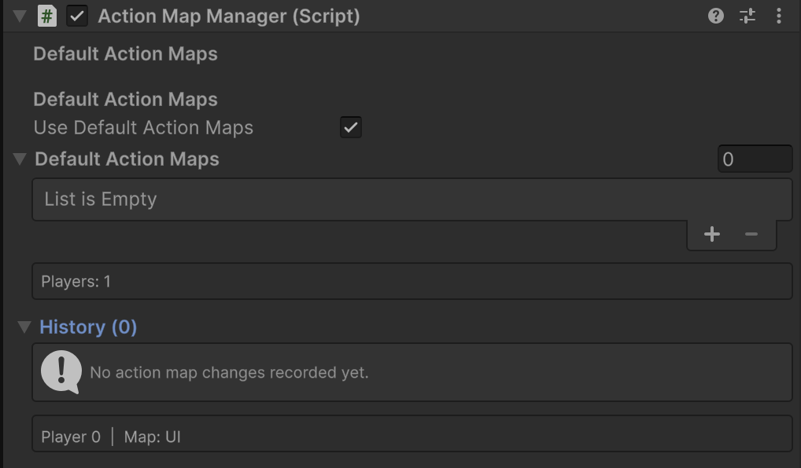
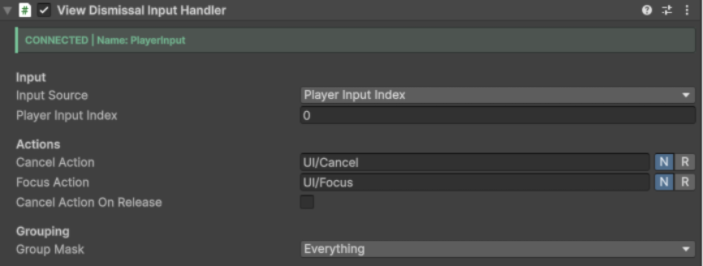
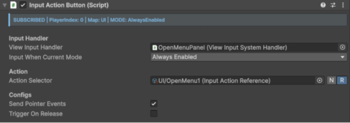

# Sentinal

A lightweight, stack-based UI navigation and focus routing system for **Unity UI (UGUI) and the Input System.** Automatically manages menu history, back-button dismissal, auto-selection, action map gating, and input-driven UI components.

[**Installation**](#installation) | [**Samples**](#samples) | [**Quick Start**](#quick-start) | [**Core Features**](#core-features) | [**Input System Integration**](#input-system-integration)

## Features & Components

### Core Navigation

Core components manage view history, stack-based routing, and focus/selection rules.

| Component                | Use / Purpose                                                                                  |
| :----------------------- | :--------------------------------------------------------------------------------------------- |
| **`SentinalViewRouter`** | Static global API managing navigation history, view stack, and active focus.                   |
| **`ViewSelector`**       | Marks a GameObject as a routable UI view; manages priority, auto-selection, and grouping.      |
| **`ViewAddress`**        | ScriptableObject asset defining a view key, allowing address-based lookup and prefab spawning. |

### Input System Handlers

Input system components control how and when input actions or map configurations are applied to focused menus.

| Component                       | Use / Purpose                                                                            |
| :------------------------------ | :--------------------------------------------------------------------------------------- |
| **`ViewInputSystemHandler`**    | Toggles active input handling depending on the view's focus and state.                   |
| **`ActionMapGate`**             | Automatically manages (enables/disables) PlayerInput action maps while a view has focus. |
| **`ViewDismissalInputHandler`** | Binds cancel/back buttons to close the current view, and select/submit to re-focus it.   |

### Input-Driven UI Components

These components automate common UI behaviors, translating input actions into button clicks, tab navigation, or text descriptions.

| Component                    | Use / Purpose                                                                      |
| :--------------------------- | :--------------------------------------------------------------------------------- |
| **`InputActionButton`**      | Triggers a UGUI Button's click event when an Input Action is pressed or released.  |
| **`InputActionButtonHold`**  | Triggers a UGUI Button's click event when an Input Action is held for a duration.  |
| **`TabbedView`**             | Swaps active panels based on selected tab Toggles.                                 |
| **`TabbedViewInputHandler`** | Binds axis/button input to switch tabs in a `TabbedView` component.                |
| **`DisplayInputString`**     | TextMeshPro text display that updates to show the binding name of an input action. |

---

## Installation

**Requirements:** Unity 2021.3+ and the **Input System** package (optional, but required for input-driven features).

### Via Unity Package Manager (Git URL)

1. Open **Window > Package Manager**.
2. Click **+** → **Add package from git URL...**.
3. Paste the URL and click **Add**:

```console
https://github.com/Tirtstan/Sentinal.git
```

### Via `manifest.json`

Add to `Packages/manifest.json`:

```json
{
    "dependencies": {
        "com.tirt.sentinal": "https://github.com/Tirtstan/Sentinal.git"
    }
}
```

---

## Samples

This package includes a pre-configured **Examples** sample containing a working physical setup. Highly recommend importing it to toy around with, see how components interact, and quickly understand how everything functions in practice.

- In Unity: **Window > Package Manager** → select `Sentinal` → **Samples** → **Examples** → **Import**.

---

## Quick Start

### 1. Set Up View Toggles

Add a `ViewSelector` component to your menu or panel root GameObjects.

- Set **Priority** to control which view gains focus when multiple are active.
- Assign a **First Selected** UI GameObject (like a button) for gamepad/keyboard auto-selection.
- Enable **Auto Select On Enable** and **Remember Last Selected** to keep selection smooth.

### 2. Connect Address-Based Navigation (Optional)

Decouple your UI scripts from scene references by using view addresses:

1. Create a `ViewAddress` asset (**Assets > Create > Sentinal > View Address**).
2. Assign the asset to your `ViewSelector`'s **Address** field.
3. Open the view from anywhere:
    ```csharp
    SentinalViewRouter.OpenView(settingsAddress);
    ```
4. Attach a **`ViewLink`** component to a standard UI Button to make it open the address on click automatically.

---

## Core Features

### View Stack & Routing (`SentinalViewRouter`)

The static `SentinalViewRouter` serves as the global manager for all active views, providing a stack history and focus resolution.

```csharp
// Open a view directly
myViewSelector.Open();

// Open a view via decoupled address (will spawn prefab if not in scene)
SentinalViewRouter.OpenView(settingsViewAddress);

// Close navigation
SentinalViewRouter.CloseCurrentView();
SentinalViewRouter.CloseAllViews(excludeRootViews: true);
```

#### View Grouping (`ViewGroupConfig`)

Manage view overlapping behavior by creating a **View Groups** config asset (**Assets > Create > Sentinal > View Groups**) placed in the `Resources` directory. Assign group masks on `ViewSelector` to define which panels can close or hide others (e.g. keeping gameplay HUD distinct from pause menus).

---

## Input System Integration

Sentinal's input components are designed to be highly flexible. While you can use the optional **`SentinalPlayer`** static utility to map player role keys to `PlayerInput` components, it is **not required** for input support.

Every input-handling component supports:

- **Direct Reference**: Manually assign a `PlayerInput` component in the Inspector.
- **Player Index Search**: Dynamically lookup a player using their index.
- **Programmatic Assignment**: Assign the target player via code at runtime.
- **SentinalPlayer Registry**: Opt-in to central role mapping (e.g., `SentinalPlayer.SetPrimaryPlayer(myPlayerInput)`).

### Action Map Gating (`ActionMapGate`)

Add an `ActionMapGate` to your view to automatically adjust active action maps while focused:

- **Configured**: Enable specific action maps and disable others.
- **Exclusive**: Enable one map and lock out all others.
- Restores original map states when the view is closed or loses focus.



### Auto-Dismissal (`ViewDismissalInputHandler`)

Add a `ViewDismissalInputHandler` to bind a general back/cancel action directly to closing the currently active view.



### Input-Driven Buttons (`InputActionButton` & `InputActionButtonHold`)

Attach these components to standard UGUI Buttons to trigger their `onClick` events through Input Actions:

- **`InputActionButton`**: Triggers on action press or release.
- **`InputActionButtonHold`**: Triggers when a hold interaction is completed, firing progress events along the way.
- _Respects Focus:_ Only triggers when the parent view is the active view in the router.



### Tab Menu Switching (`TabbedView` & `TabbedViewInputHandler`)

Organize sub-menus with tabs:

- **`TabbedView`**: Links Toggle group tabs to sub-panels.
- **`TabbedViewInputHandler`**: Binds a switch action (like gamepad bumpers/triggers) to scroll through tabs.


### Displaying Input Bindings (`DisplayInputString`)

Add this to a TextMeshPro component to automatically print the name/glyph representing an action's binding (e.g., "[Space]" or "[A Button]"). Automatically updates when the player's control scheme changes.


---

## Best Practices

- **Use Root Views**: Mark persistent UI (like a HUD) as `rootView = true` so the back-button routing doesn't close them.
- **Isolate Layers with Group Masks**: Use group masks to prevent gameplay overlays from hiding full-screen pause menus.
- **Clean Up Code References**: Use `ViewAddress` and `ViewLink` to avoid dragging scene references between UI panels and game managers.
