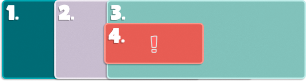
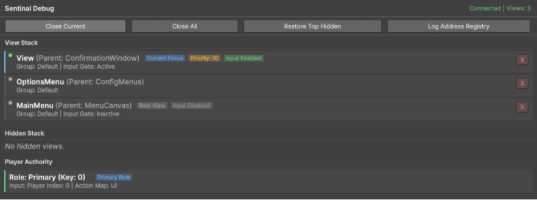

# Sentinal



Sentinal is a lightweight routing and input-control **package for Unity UGUI**. It gives menus a real navigation stack, automatic keyboard/gamepad selection, cancel/back handling, view-layer isolation, and Input System action-map gating with minimal set-up.

It is built for projects where UI is driven by controllers as much as mouse clicks: pause menus, settings screens, couch co-op lobbies, tabbed panels, modal prompts, and gameplay HUD overlays that must coexist without fighting for focus.

[**Quick start**](#quick-start) | [**Why Sentinal**](#why-sentinal) | [**Components**](Documentation/Components.md) | [**Installation**](#installation) | [**Samples**](#samples)

---

## Why Sentinal


_The Sentinal Debug Window (**Window > Sentinal > Debug**) displaying active view stack history, parent GameObjects, priorities, and input gates._

- **Real view routing for UGUI**: Mark any menu with `ViewSelector`, open it directly, or route to it through a `ViewAddress` ScriptableObject.
- **Controller-first focus**: Automatically selects the right button when views open, remembers the last selected control, and resolves overlapping views by priority and recency.
- **Stack-based back behavior**: `ViewDismissalInputHandler` wires cancel/back input to the top non-root view, so `Esc`, `B`, or `Circle` behaves consistently across screens.
- **Layer-safe menus**: `ViewGroupMask` or Root views keeps gameplay HUDs, popups, pause menus, overlays, and tab panels from closing or hiding each other accidentally.
- **Input System integration**: Gate action maps per focused view, target primary/all/specific players, and bind input actions directly to buttons and tabs.
- **No manager prefab required**: Views self-register with the static router, and Sentinal resets its static state for Fast Enter Play Mode.

## Quick Start

### 1. Make a panel routable

Add `ViewSelector` to a UGUI panel or screen.


Set:

- **First Selected** to the first button, toggle, or selectable control.
- **Priority** if this view should take focus over other open views.
- **Root View** for persistent screens such as HUDs or main menu roots.

Then open or close it like any normal GameObject-backed screen:

```csharp
settingsView.Open();
settingsView.Close();
```

### 2. Open views without scene references

Create a `ViewAddress` asset from **Assets > Create > Sentinal > View Address**, assign it to the view's **Address** field, and route to it from anywhere:

```csharp
using Sentinal;

public sealed class AddressOpener
{
    public ViewAddress address; // assign SettingsAddress, PauseAddress, etc.

    public void Open()
    {
        SentinalViewRouter.OpenView(address);
    }
}
```

For no-code button navigation, add `ViewLink` to a UGUI `Button` and assign the same address.

### 3. Add controller-friendly back navigation

Add `ViewDismissalInputHandler` to a persistent UI object, then point it at your cancel action, usually `UI/Cancel`.


When the action fires, Sentinal closes the focused non-root view and restores the next valid selection.

### 4. Gate gameplay input while menus are focused

Add `ActionMapGate` to a view when opening that view should change the active Input System maps.


Common setup:

- Pause menu: enable `UI`, disable `Gameplay`.
- Text prompt: use exclusive `UI`.
- Local multiplayer lobby: target all players, or target a specific `SentinalPlayer` key.

## Component Map

| Area                  | Use these                                                                                                  | What they solve                                                                                |
| --------------------- | ---------------------------------------------------------------------------------------------------------- | ---------------------------------------------------------------------------------------------- |
| Routing               | `SentinalViewRouter`, `ViewSelector`, `ViewAddress`, `ViewLink`                                            | Open, close, focus, and address UGUI views without brittle scene references.                   |
| View layering         | `ViewGroupConfig`, `ViewGroupMask`                                                                         | Isolate HUDs, menus, popups, overlays, and tabs by channel.                                    |
| Input ownership       | `SentinalPlayer`, `ViewInputSystemHandler`, `ActionMapGate`, `ViewDismissalInputHandler`                   | Route UI input to the right player and toggle action maps by focused view.                     |
| Input-driven controls | `InputActionButton`, `InputActionButtonHold`, `TabbedView`, `TabbedViewInputHandler`, `DisplayInputString` | Trigger buttons, hold actions, tab switching, and input glyph-style labels from Input Actions. |
| Text prompts          | `TextInputGateway`, `PromptedTextField`                                                                    | Present platform-appropriate text entry flows from normal UGUI buttons.                        |

Read the full component guide here: [Documentation/Components.md](Documentation/Components.md).

## Installation

### Requirements

- Unity `2021.3` or newer.
- UGUI.
- Unity Input System for the `Sentinal.InputSystem` assembly and input components.
- TextMeshPro for text prompt and display helpers.

### Unity Package Manager

1. Open **Window > Package Manager**.
2. Click **+**.
3. Choose **Add package from git URL...**.
4. Paste:

```text
https://github.com/Tirtstan/Sentinal.git
```

## Samples

Import **Examples** from the Package Manager to see configured scenes for routing, input-gated menus, action buttons, and tabbed navigation.

Path in package: `Samples/Examples`

## Debugging

Sentinal includes an editor debug window (**Window > Sentinal > Debug**) for inspecting active views in history and the hidden stack, displaying each view's name alongside its parent GameObject name, priority, group mask, and input gate status. Use it when a view does not close, focus, or restore the way you expect.

The static router also exposes:

```csharp
SentinalViewRouter.CurrentView;
SentinalViewRouter.GetViewHistory();
SentinalViewRouter.GetDebugString();
```
