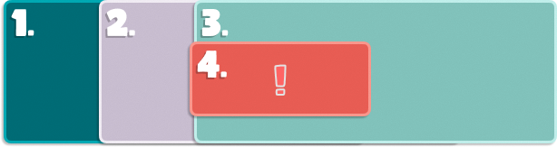
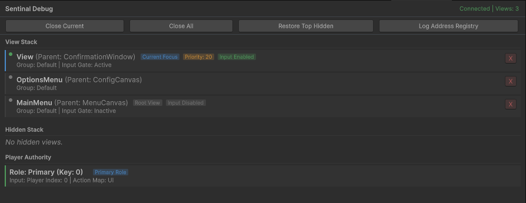

# Sentinal



Sentinal is a routing and input-control package for Unity UGUI. It gives menus a navigation stack, automatic keyboard and gamepad selection, cancel and back handling, view-layer isolation, and Input System action-map gating.

It is intended for projects where controllers matter as much as mouse clicks. Use it for pause menus, settings screens, couch co-op lobbies, tabbed panels, modal prompts, and gameplay HUD overlays that need to share focus safely.

[Quick start](#quick-start) | [Why Sentinal](#why-sentinal) | [Components](Documentation/Components.md) | [Installation](#installation) | [Samples](#samples)

---

## Why Sentinal


_The Sentinal Debug Window at **Window > Sentinal > Debug**. It shows view history, parent GameObjects, priorities, and input gates._

- Mark a menu with `ViewSelector` to route it directly or through a `ViewAddress` ScriptableObject.
- Sentinal selects an initial control when a view opens and remembers the last selected control. View priority and recency decide which open view receives focus.
- `ViewDismissalInputHandler` sends cancel or back input to the top non-root view. `Esc`, `B`, and `Circle` can use the same path.
- `ViewGroupMask` and root views keep HUDs, popups, pause menus, overlays, and tab panels from closing or hiding one another.
- `ActionMapGate` changes Input System action maps for a focused view. You can target the primary player, all players, or specific `SentinalPlayer` keys. Fresh-press gating prevents the button that opened or closed a view from triggering another control.
- Views register with the static router, so no manager prefab is required. Sentinal also clears its static state when you use Fast Enter Play Mode.

## Quick start

### 1. Make a panel routable

Add `ViewSelector` to a UGUI panel or screen.


Set these fields:

- **First Selected** to the first button, toggle, or selectable control.
- **Priority** if this view should take focus over other open views.
- **Root View** for persistent screens such as HUDs or main menu roots.

Open or close the screen through its component:

```csharp
settingsView.Open();
settingsView.Close();
```

### 2. Open a view without a scene reference

Create a `ViewAddress` asset from **Assets > Create > Sentinal > View Address**. Assign it to the view's **Address** field, then route to it from anywhere:

```csharp
using Sentinal;

public sealed class AddressOpener
{
    public ViewAddress address; // assign SettingsAddress, PauseAddress, etc.

    public void Open()
    {
        SentinalViewRouter.OpenView(address);
    }
}
```

For button navigation without code, add `ViewLink` to a UGUI `Button` and assign the same address.

### 3. Add back navigation

Add `ViewDismissalInputHandler` to a persistent UI object and assign your cancel action, usually `UI/Cancel`.


When the action fires, Sentinal closes the focused non-root view and restores a valid selection.

### 4. Gate gameplay input while a menu is focused

Add `ActionMapGate` to a view when opening it should change the active Input System action maps.


For example:

- A pause menu can enable `UI` and disable `Gameplay`.
- A text prompt can use an exclusive `UI` map.
- A local multiplayer lobby can target all players or a specific `SentinalPlayer` key.

## Component map

| Area                  | Use these                                                                                                  | What they do                                                                                   |
| --------------------- | ---------------------------------------------------------------------------------------------------------- | ---------------------------------------------------------------------------------------------- |
| Routing               | `SentinalViewRouter`, `ViewSelector`, `ViewAddress`, `ViewLink`                                            | Open, close, focus, and address UGUI views without direct scene references.                    |
| View layering         | `ViewGroupConfig`, `ViewGroupMask`                                                                         | Separate HUDs, menus, popups, overlays, and tabs by channel.                                   |
| Input ownership       | `SentinalPlayer`, `ViewInputSystemHandler`, `ActionMapGate`, `ViewDismissalInputHandler`                   | Route UI input to a player and change action maps for the focused view.                       |
| Input-driven controls | `InputActionButton`, `InputActionButtonHold`, `TabbedView`, `TabbedViewInputHandler`, `DisplayInputString` | Trigger buttons, hold actions, tab changes, and input labels from Input Actions.               |
| Text prompts          | `TextInputGateway`, `PromptedTextField`                                                                    | Start platform text-entry flows from UGUI buttons.                                             |

Read the full component guide here: [Components.md](Documentation/Components.md).

## Installation

### Requirements

- Unity `2021.3` or newer.
- UGUI.
- Unity Input System for the `Sentinal.InputSystem` assembly and input components.
- TextMeshPro for text prompt and display helpers.

### Unity Package Manager

1. Open **Window > Package Manager**.
2. Click **+**.
3. Choose **Add package from git URL...**.
4. Paste:

```text
https://github.com/Tirtstan/Sentinal.git
```

## Samples

Import **Examples** from the Package Manager to try scenes for routing, input-gated menus, action buttons, and tabbed navigation.

Path in package: `Samples/Examples`

## Debugging

Sentinal includes an editor debug window at **Window > Sentinal > Debug**. It shows active views, hidden view history, parent GameObject names, priorities, group masks, and input-gate status. Use it when a view does not close, receive focus, or restore the expected selection.

The static router also exposes:

```csharp
SentinalViewRouter.CurrentView;
SentinalViewRouter.GetViewHistory();
SentinalViewRouter.GetDebugString();
```
