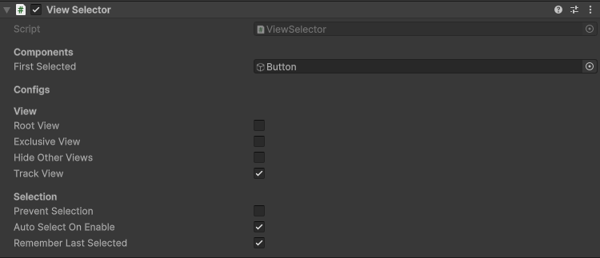

# Sentinal - Unity Menu Navigation & UI Selection System

A Unity package for managing hierarchical menu navigation with history tracking, input system integration, and automatic UI element selection. Perfect for game menus, settings panels, and any UI that requires structured navigation flow.

> [!NOTE]  
> This does not replace **UGUI's navigation system.**

## 🚀 Quick Start

1. **Add the Core Manager**: Place the `SentinalManager` singleton component in your scene.
2. **Setup Menu Views**: Add `ViewSelector` components to your active toggling menu GameObjects.
3. **Optional Input Integration**: Add `InputSystemHandler` for re-selection and back tracking actions.
4. **Optional Action Map Switching**: Add `InputActionSwitcher` for action map switching.

> [!TIP]  
> Use the provided **Sentinal** prefab from the samples for quick setup.

> [!IMPORTANT]  
> **The `SentinalManager` component is required for this package to work. Navigation is triggered by GameObject activation/deactivation (`OnEnable`/`OnDisable`).**

## ✨ Features

### Core Navigation

-   **Menu/View Tracking**: Navigate through multiple menus with automatic history tracking.
-   **UI Selection**: Auto-selection of UI elements with memory of last selected items.
-   **Root View Support**: Persistent root menus that stay in history but don't auto-close.
-   **Exclusive Views**: Views that close all other menus when opened (excluding root views).

### Input System Integration

-   **Action Map Switching**: Automatic switching between Player/UI (or custom) action maps.
-   **Configurable Actions**: Customisable input actions for canceling and re-selecting.

## 🔧 Core Components

### `SentinalManager` (Singleton Manager)

The central manager that handles all view/menu navigation logic and maintains the view stack.


**Public API:**

-   `CloseCurrentView()` - Close the topmost view in the stack.
-   `CloseAllViews()` - Close all views except root views.
-   `TrySelectCurrentView()` - Attempt to select the current view's UI element.
-   `AnyViewsOpen` - Check if any views are currently open.
-   `CurrentView` - Get the currently active view selector.

**Events:**

-   `OnAdd` - Fired when a new view is added to the stack.
-   `OnRemove` - Fired when a view is removed from the stack.
-   `OnSwitch` - Fired when switching between views.

### `SentinalViewSelector` (Menu Component)

Add this to any GameObject that represents a menu or navigable view. One that will be `SetActive(bool)`.



#### **Properties:**

##### **View**

-   `firstSelected` - The GameObject to auto-select when this view becomes active.
-   `rootView` - Treat as root view (added to history but never closed automatically).
-   `exclusiveView` - Close all other views (except root views) when this view opens.
-   `hideAllViews` - Hides all other views when opened. Unlike exclusive, this only hides them temporarily.
-   `trackView` - Whether to include this view in the navigation history stack.

##### **Selection**

-   `preventSelection` - Prevent automatic selection (useful for input-only views).
-   `autoSelectOnEnable` - Automatically select the first element when the view is enabled.
-   `rememberLastSelected` - Remember and restore the last selected UI element.

### `InputSystemHandler` (Optional Input Manager)

Handles Input System integration for input navigation. **Requires `SentinalManager` component.**


### `InputActionSwitcher` (Auto Action Map Switching)

Automatically switches between action maps when a view opens/closes. **Requires `ViewSelector` component.**


## 🎯 Usage Examples

### Basic Menu Setup

```csharp
// Your menu GameObject needs:
// 1. SentinalViewSelector component
// 2. Enable/Disable the GameObject to open/close menus

// Open a menu
menuGameObject.SetActive(true); // Automatically tracked by SentinalManager (if ViewSelector is present)

// Close current menu
SentinalManager.Instance.CloseCurrentView();

// Close all menus
SentinalManager.Instance.CloseAllViews();
```

### Custom Closeable Menu With `ICloseableView`

```csharp
[RequireComponent(typeof(ViewSelector))]
public class CustomMenu : MonoBehaviour, ICloseableView
{
    [SerializeField] private Animator menuAnimator;

    public void Close()
    {
        // Custom close logic (animations, save data, etc.)
        StartCoroutine(CloseWithAnimation());
    }

    private IEnumerator CloseWithAnimation()
    {
        menuAnimator.SetTrigger("CloseMenu");
        yield return new WaitForSeconds(0.3f);
        gameObject.SetActive(false);
    }
}
```

### Event Handling & Stack Monitoring

```csharp
private void Start()
{
    SentinalManager.OnAdd += OnMenuOpened;
    SentinalManager.OnRemove += OnMenuClosed;
    SentinalManager.OnSwitch += OnMenuSwitched;
}

private void OnMenuOpened(SentinalViewSelector view)
{
    Debug.Log($"Menu opened: {view.name}");
    // Update UI, play sounds, etc.
}

private void OnMenuSwitched(SentinalViewSelector from, SentinalViewSelector to)
{
    Debug.Log($"Switched from {from?.name} to {to?.name}");
    // Handle transition effects
}
```

## 📋 Requirements

-   **Unity 2019.4** or later
-   **Input System package** (optional, for input handling features)
-   **TextMeshPro** (for sample scenes)

## 🐛 Debugging

### Runtime Inspector

The custom editor shows real-time debugging information:

-   Current view index in the navigation stack.
-   Whether the view is currently active.
-   View hierarchy visualization.

## 📝 Best Practices

1. **Always use GameObject activation (`SetActive(bool)`)** for menu open/close operations.
2. **Use `ICloseableView`** for menus that need custom close animations or specific menu closure.
3. **Use Root Views** for persistent UI elements like HUDs or a main menu screen.
4. **Use Exclusive Views** for modal dialogs or full-screen overlays.
